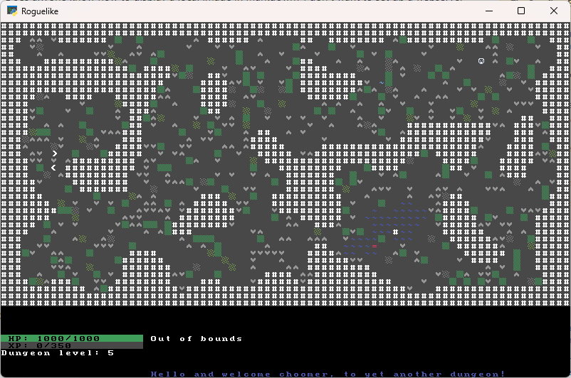
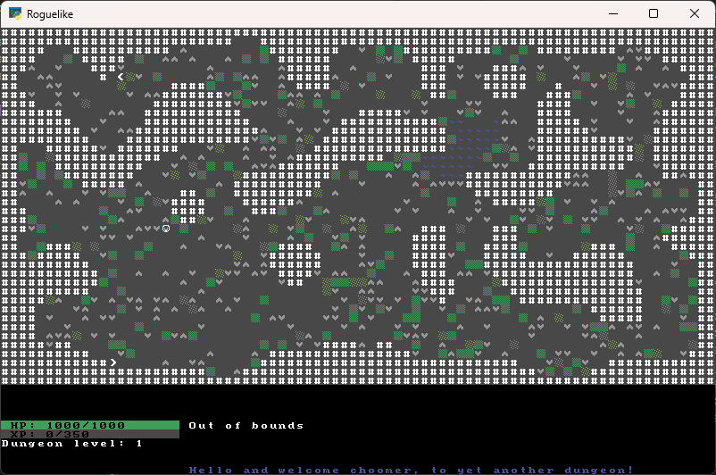
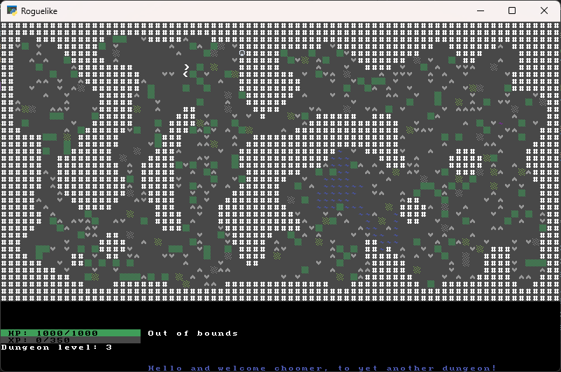

# Aquifers

## Troubles in The Water Town

New troubles and ideas, I've started introduction of one of the next "decorators" for my procedural generator.

Aquifers

I already scatter random blobs of tall and short grass as well as some rocky features one can find in caves naturally, such as stalagmites and stalactites. But that's simple and boring. We need a little bit more than that. That's why I wanted for a long time get some water features going on. First step was taken on February 2nd in commit [9edabea](https://github.com/kriomentos/rougelike-tcod/commit/9edabea12bc367e7bd3052f815ccafd1aff12d78) which was a simple "take a random tile and surround it with water" it included the obvious needs of adding new tiles to graphically represent said water.

After that was done life got busy, head was empty with ideas so we return later to tinker some more. This time decision fell on using already implemented [drunken_walk](https://github.com/kriomentos/rougelike-tcod/blob/main/helpers/diggers.py#L26) algorithm, idea was sound in my head. We will take random start point, randomly choose one of the major cardinal directions and select endpoint in that direction going as far as half size of the map. Idea was good, but we forget that nature of said algorithm is that it's *random*. And it can *finish* but not necessarily in reasonable time. Which is not ideal for our use case, we need something quick and efficient.

Another issue that emerged during testing phase was that the algorithm wasn't behaving as expected and was just generating straight lines from start to end, rather than expected randomly scattered bits. So I had to scrape this idea or rewrite the algorithm.

After some time of trying things out and having various outcomes I managed to land on a solution that kinda works in a way I like it, here's relevant code:

```python
def add_aquifers(x: int, y: int, dungeon: GameMap):
    chance = nprng.random()

    start = (x, y)

    spill_size = nprng.integers(1, 10)
    max_step = 50 # nprng.integers(0, 50)
    spill_step = 0
    spill_direction = nprng.integers(0, 3)

    if spill_direction == 0:
        end = (x - spill_size, y - spill_size)
    elif spill_direction == 1:
        end = (x - spill_size, y + spill_size)
    elif spill_direction == 2:
        end = (x + spill_size, y - spill_size)
    elif spill_direction == 3:
        end = (x + spill_size, y + spill_size)

    while spill_step != max_step:
        if nprng.random() < .5: # go down or up
            x += 1
        else:
            x += -1

        if nprng.random() < .5: # go left or right
            y += 1
        else:
            y += -1

        spill_step += 1

        x = max(1, min(x, dungeon.width - 3))
        y = max(1, min(y, dungeon.height - 3))

        dungeon.tiles[x, y] = tile_types.shallow_water

    return
```

It's of course not the smartest or best possible solution, but it's mine and does the intended job for now. It will definitely change and evolve over time as right now it's not elegant nor checked for performance.

So what it does? It selects starting point and then randomly set end point which can be in four directions from starting point at least 1 point away and at furthest 10 points away in each of two coordinates (x, y). After that is decided I have strict rule of taking only 50 'drunken' steps and exit the loop. On each step we decide to go up/down or left/right. So we go in one direction each step (otherwise it makes a checkerboard pattern). Then we clamp the values to the size of the map reducing it by 3 to avoid going too deep into any bounding walls. Last thing we need to do is make the tiles water and exit the function.

It is quite performant for quick and dirty algorithm and results are quite nice albeit still require some work. Sample screens below.




